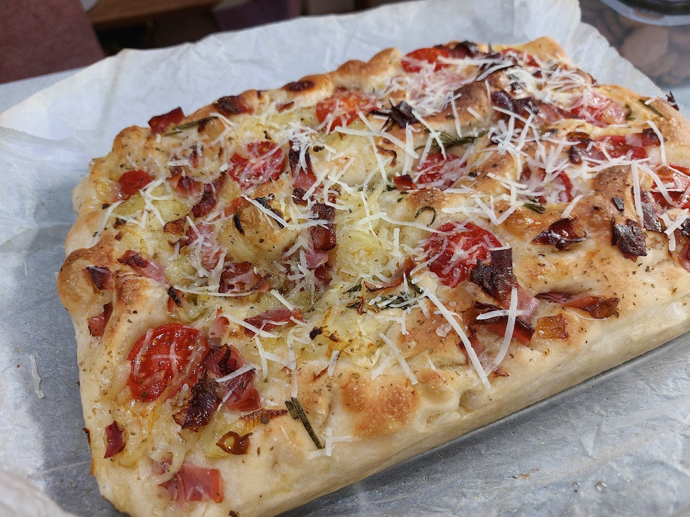
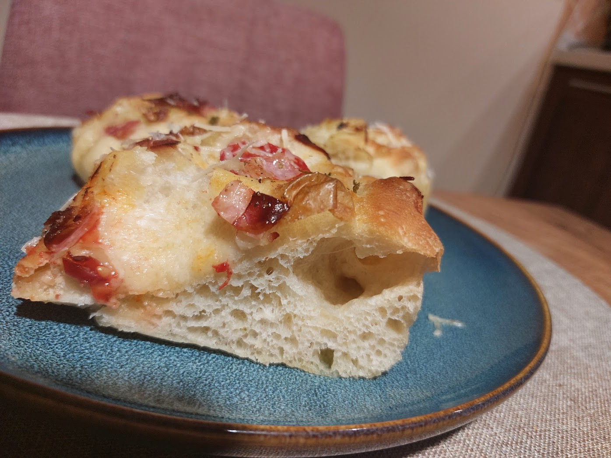

## ▶ Hozzávalók

|  |  |
|----------|----------|
|**400 ml**|víz|
|**12 g**|friss élesztő|
|**1 tk**|cukor|
|**500 g**|liszt|
|**2 ek**|oliva olaj (meg külön a kenéshez)|
|**2 tk**|só (meg majd durva só a tetejére)|

## ▶ Elkészítés:
1. Egy nagy tálban keverjük össze a vizet a friss élesztővel és a cukorral Keverjük addig, amíg az élesztő teljesen fel nem oldódik
2. Szitáljuk bele a lisztet, majd keverjük össze amíg az összetevők össze nem állnak – a tészta puha és könnyen keverhető lesz
3. Öntsünk bele 2 evőkanál olívaolajat és 2 teáskanál sót. Keverjük össze, amíg egynemű nem lesz
4. Kaparjuk le a tál faláról a tésztát. Fedjük le, és hagyjuk pihenni `30 percig`.
5. Vízes kézzel a tészta négy szélét hajtsuk be a közepe felé, majd emeljük meg a tésztát a közepénél és ejtsük vissza az edénybe, ha elkezdene ragadni a tészta a kezünkhöz, vízezzük be a kezünket
6. Takarjuk le és hagyjuk pihenni `30 percet`
7. Hajtogassuk meg az ismételten ahogy az 5. lépésben
8. Kenjük ki a sűtőpapíros tepsit gazdagon oliva olajjal
9. Óvatosan rakjuk a tésztát a tepsibe és próbáljuk meg szétteríteni, nem baj ha nem megy teljesen, a következő pihentetésig fog még lazulni
10. Takarjuk le és hagyjuk pihenni `30 percet`
11. Melegítsük elő a sűtőt `230 fokra`
12. Ujjainkkal nyomkodjuk be a tésztát, bátran, amíg nem érezzük a tepsi alját
13. Kenjük le oliva olajjal, majd rakjuk rá a hozzávalókat, figyelve hogy olyanokat pakoljunk rá amí nem fog megégni
14. Süssük `20 percig` amíg aranybarna nem lesz
15. Majd rakjuk rácsra hogy ki tudjon szikkadni kicsit és hűlni