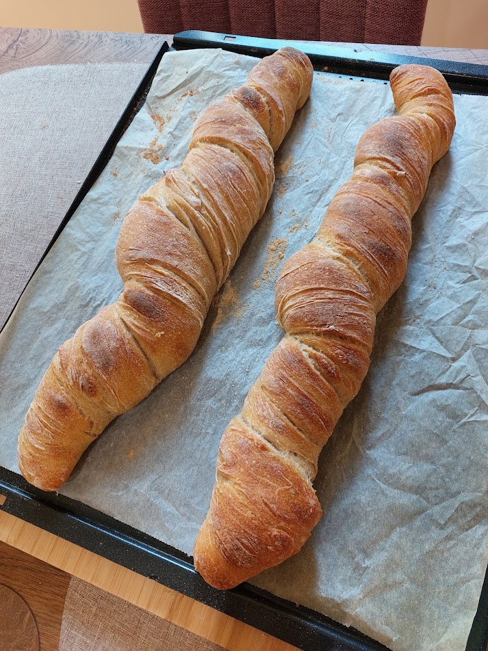

## ▶ Kovászos előtészta
|  |  |
|----------|----------|
|**45 g**|anyakovász|
|**30 g**|BL-80 fehér kenyér liszt|
|**30 g**|BL-200 teljes kiörlésű liszt|
|**60 ml**|40°C fokos víz|

## ▶ Tangzhong
|  |  |
|----------|----------|
|**35 g**|BL-80 fehér kenyér liszt|
|**20 g**|BL-200 teljes kiörlésű liszt|
|**230 ml**|víz|

## ▶ Tészta
|  |  |
|----------|----------|
|**350 g**|BL-80 fehér kenyér liszt|
|**150 g**|BL-55 liszt|
|**280 ml**|40°C fokos víz|
|**15 g**|só|
|**teljes mennyiség**|Tangzhong|
|**teljes mennyiség**|Kovászos előtészta|

## ▶ Elkészítés
- A Kovászos előtészta elemeit összekeverjük és `4-8 óráig` érleljük, hőmérséklettől és évszaktól függően
- Tangzhong elészítése, hűtőzhető is előző napról, lényeg hogy szobahőmérsékletűen kerüljön majd a tésztába
- A kovászt figyelve kb 1 órával a teljes felfutás elérése előtt elkezdjük a tészta autolízisét, a liszteket és a vízet összedagasztjuk és `1 órát` hagyjuk pihenni
- Hozzáadjuk a szobahőmérsékletű tangzhongot és a kováaszos előtésztát és jól eldolgozzuk
- `15 percig` hagyjuk pihenni
- Hozzáadjuk a sót és ismételten alaposan megdagasztjuk
- Enyhén kiolajozott tálba helyezzük, lefedjük, majd hagyjuk `1 órát` pihenni
- Enyhén kiolajozott vagy lisztezett felületen kilamináljuk, majd visszatesszük a tálba
- További `5-9 órát` hagyjuk pihenni
- Előkészítünk egy sűtőpapíros tepsit
- A tésztát bőségesen kilisztezett felületre rakjuk, belisztezzük a tetejét is, kicsit téglalap alakúra mocorogtatjuk, majd kettévágjuk a hosszanti oldala mentén, áthelyezzük a tepsire majd hosszanti irányba megtekergetjük vigyázva hogy ne nyomjuk ki belőle a meglévő gázokat. (Az egy-egy tekerés kb egy bevágásnak felel meg, azok mentén fog a tészta majd jól sülni)
- Letakarjuk konyharuhával vagy fóliával és `30 percet` hagyjuk pihenni
- Párásítós módon `230°C fokra` hevítsük a sűtőt
- Ezen a hőmérsékleten sütjük `15 percig`
- Majd alul-felül módban `210°C fokon` további `15-20 percig` sütjük
- A kenyereket spricceljük le vízzel, majd rácsony hagyjuk kihűlni