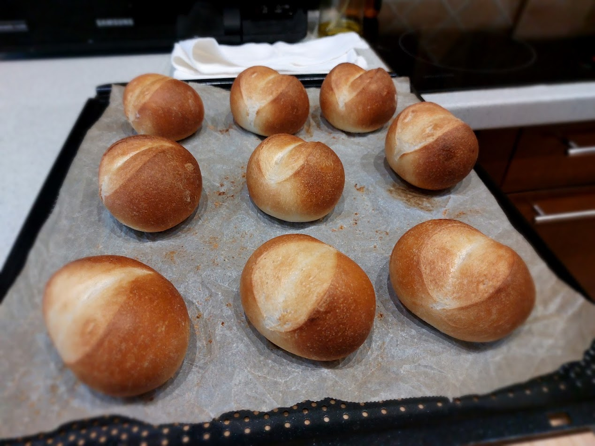
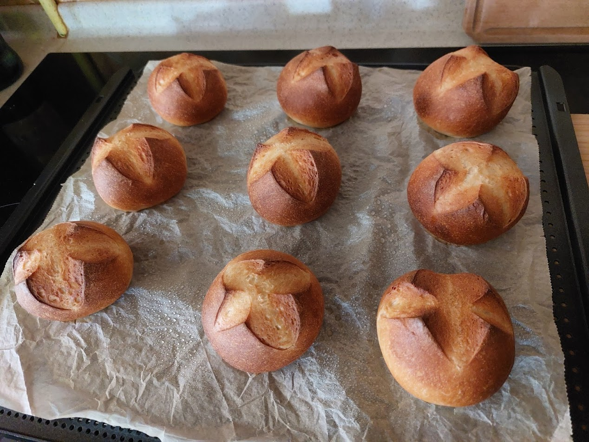

## ▶ Előtészta (poolish)
|  |  |
|----------|----------|
|**130 g**|BL-55 liszt|
|**90 g**|~30-40°C fokos víz|
|**3,5 g**|Friss élesztő|
|**3 g**|só|

## ▶ Főtészta
|  |  |
|----------|----------|
|**az egész**|Előtészta|
|**305 g**|BL-55 liszt|
|**70 g**|~30-40°C fokos víz|
|**100 g**|szobameleg tej|
|**11 g**|Friss élesztő|
|**6 g**|só|
|**6 g**|Fehércukor|

## ▶ Elkészítés
- Keverjük össze az előtészta hozzávalóit és egy légmentesen lezárt edényben hagyjuk a hűtőben `24-48-72 órát` érni amíg kb megduplázódik a térfogat és bubis a tészta
- Keverjük össze a vizet, cukrot és élesztőt és hagyjuk hogy felfusson kb `10 perc` alatt
- Adjuk hozzá az összes többi Főtészta hozzávalót és az Előtésztát majd lassú fokozaton dagasszuk amíg a nedvességet felszívja utána mehet kettes fokozatra `5-10 percre`
- Zárjuk le légmentesen az edényt, pihenjen `30 percet`
- Lamináljuk, utána tegyük vissza az edénybe
- Ismét hagyjuk pihenni `30 percet`
- Egy tepsire készítsünk be egy sűtőpapírt
- Osszuk 9 egyenlő darabra a tésztát és slusszal lefele tegyük a tepsire
- Hagyjuk állni `45 percet`
- Párásítós módon `230°C fokra` hevítsük a sűtőt
- Vágjuk meg a zsemléket majd spricceljük le vízzel és mehetnek is a sütőbe
- Kb `10 percig` süssük a zsemléket amíg szép színet kapnak.