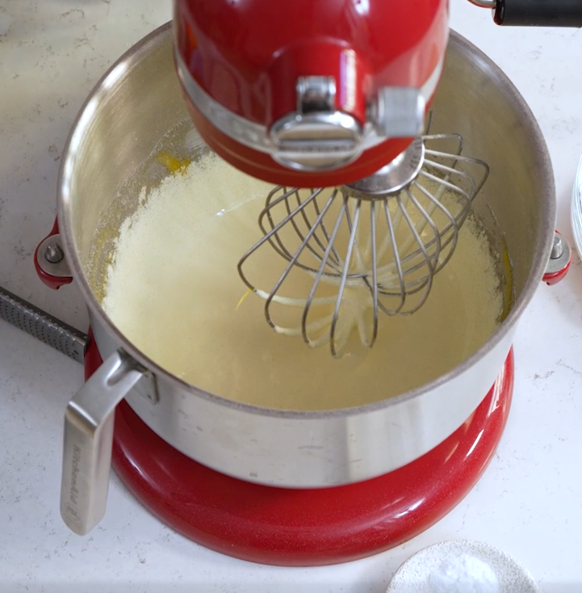
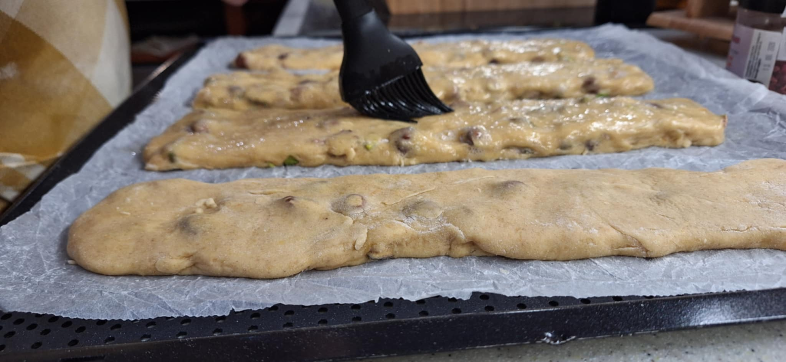
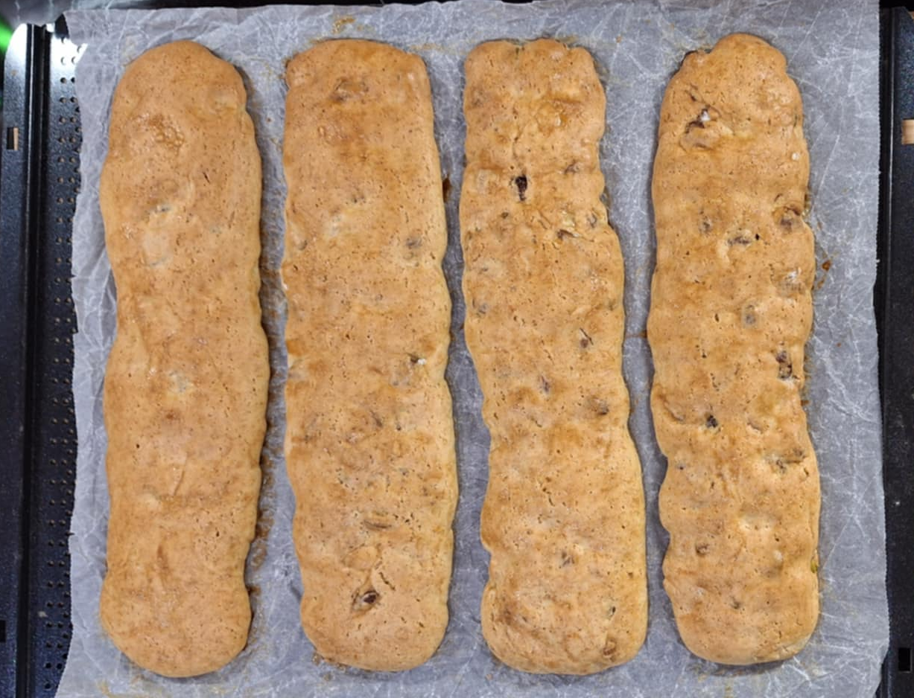
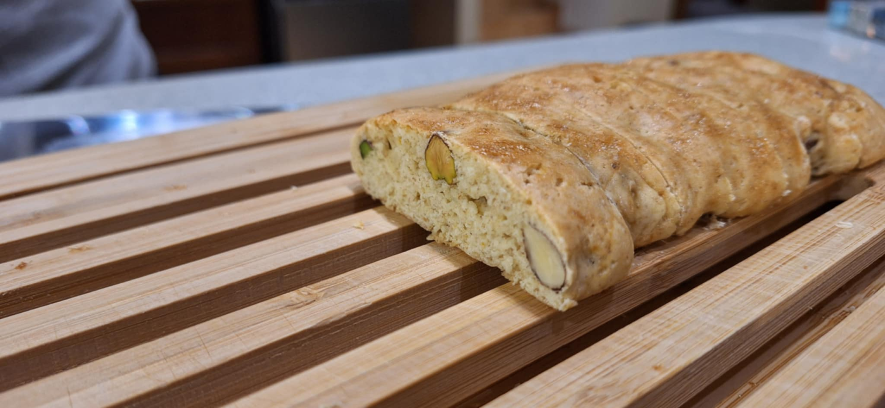
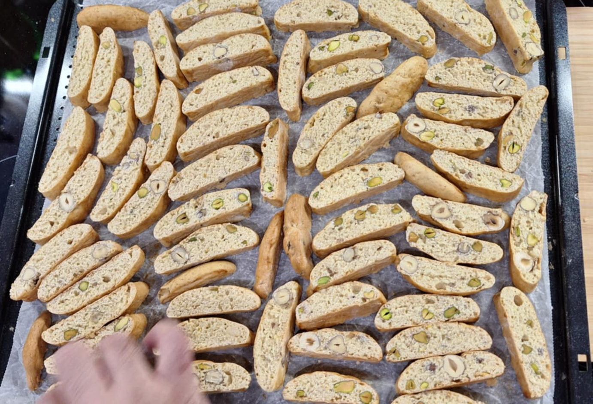
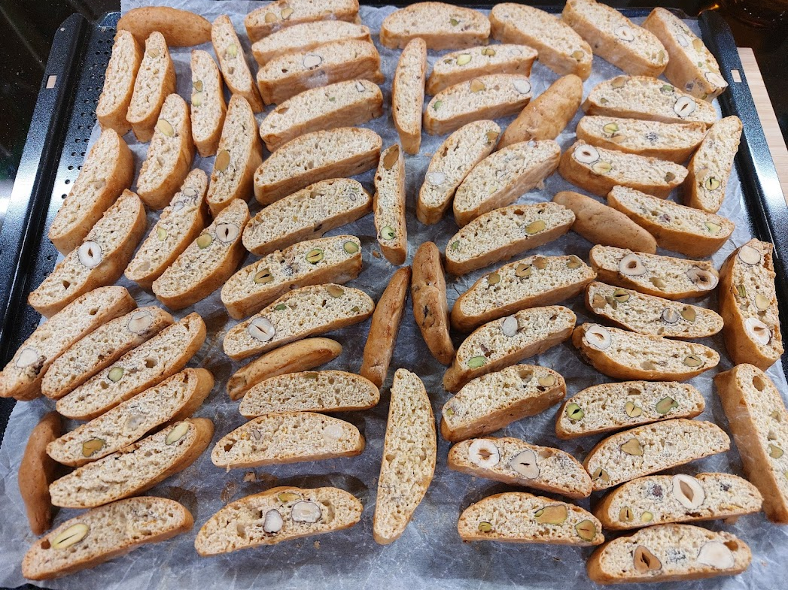

## ▶ Hozzávalók

|  |  |
|----------|----------|
|**200 g**|anyakovász (vagy 150 g friss kovász)|
|**300-350 g**|BL-55 liszt|
|**150 g**|mandula, de más olajos magvakkal variálható|
|**250 g**|fehér cukor|
|**1 db**|tojás|
|**3 db**|tojás sárgája (fehérjükből végén kenünk a tetejére)|
|**5 g**|só|
|**1/4 - 1/2 teáskanál**|szódabikarbóna (elhagyható)|
|**2 teáskanál**|vanília kivonat (egy tasak vanilíás cukorral helyettesíthető) (elhagyható)|
|**némi**|narancshéj (elhagyható)|

## ▶ A tészta előkészítése

- A tojásokat és a cukrot fokozatosan keverjük össze habverő (kézi vagy gépi) segítségével, míg könnyed és levegős lesz és sárga színről fehérre válik.
??? note "-"

    **1 db** tojás

    **3 db** tojássárgája

    **250 g** fehér cukor

- Adjuk hozzá a következőket és keverjük el alaposan a habverővel:
???+ note "-"

    **5 g** só

    **1/4 - 1/2 teáskanál** szódabikarbóna (elhagyható)

    **2 teáskanál** vanília kivonat (egy tasak vanilíás cukorral helyettesíthető) (elhagyható)
    
    **némi** narancshéj (elhagyható) 

- Adagoljuk bele az anyakovászt is
??? note "-"

    **200 g** anyakovász (vagy 150 g friss kovász)

- Váltsunk dagasztó fejre (ha géppel) és lassan adagoljuk bele a lisztet kanalanként, nem szabad egyszerre mert kinyomja a levegőt belőle amit a tojás felverésekkor belekerült.
??? note "-"

    **300 g** BL-55 liszt

- Keverjük addig amíg nincsenek már benne lisztbuckák, ha nagyon folyós volt az anyakovász egy 50 g lisztet még elbír a süti
!!! danger "!"

    Az **50 g BL-55** lisztet csak ha nagyon folyós volt az anyakovász!

- Tegyük hűtőbe **10-30 percre** a könnyebb formázás érdekében

## ▶ Hűtés és pirítás

- Amíg a tészta hül, addig melegítsük elő a sütőt **200°C fokra**

- A kiválasztott olajos magvakat rakjuk egy kis tepsibe (vigyázva hogy a tepsi oldalához ne érjenek, mert akkor nagyon megpirulhatnak) és **3-5 percig** pirítsuk a sűtőben, majd vegyük ki őket és a tésztába keverés előtt minimum **10 percet** hagyjuk őket kihülni.

- **150 g** mandula, de más olajos magvakkal variálható

- A sütőt ne kapcsoljuk ki, csak vegyük le **180°C fokra**

## ▶ Tészta előkészítése a sütésre

- Keverjük bele lassan az olajos magvakat a tésztába

- Készítsük elő a sűtőpapíros tepsit.

- Szórjuk fel a gyűró felületet bőségesen liszttel (nem baj ha látszik a liszt, le fogjuk kenni még)

- Szórjunk a tetejére is lisztet és lisztes kézzel és ha kell lisztes segédeszközzel tereljük egy téglalap alakba

- Osszuk fel a tésztát kb 4 egyenlő kis téglalapra, majd egyesével emeljük át a sütőpapírra és formázzunk belőle egy hosszú kigyót/hurkát/kolbász/akármit, csak legyen olyan hosszú mint a tepsi kb és ne legyen nagyon keskeny

- A maradék tojásfehérjébe egy csipet sót rakva felverjük, nem habosra, csak hogy jobban kezelhető legyen (ebben segít a csipet só is hogy folyósabb lesz), majd kenjük le a sütemény tetejét.

## ▶ Sütés

- Középen, **alul-felül** sütésben süssük **légkeverés nélkül** **25-30 percig**, amíg aranybarna nem lesz

- Majd vegyünk ki és várjunk **10 percet** míg addig hül amíg szabad kézzel kényelmesen megfogható

## ▶ Második sütés (elhagyható ha puhábban szeretjük)

- Vágjuk fel kb **2 cm széles** szeletekre és helyezzük őket vissza a tepsibe az oldalukra fordítva

- Majd helyezzük vissza a tepsit a sütőbe 5-10 percre amíg színt kapnak

- Itt még melegen puhábbnak tűnhet, de ahogy kihül elnyeri a kekszes jellegét.