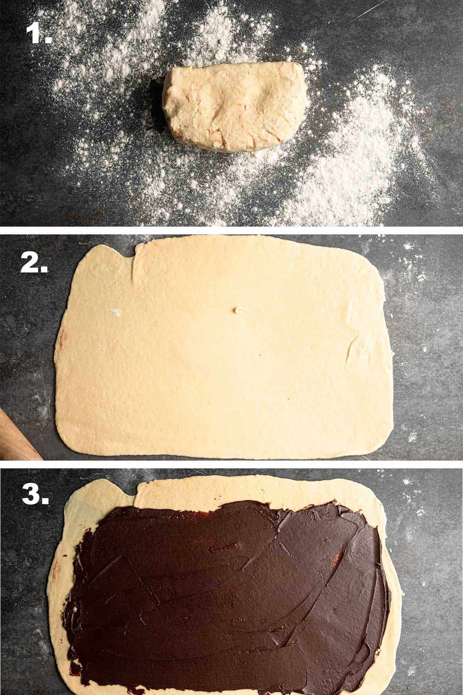
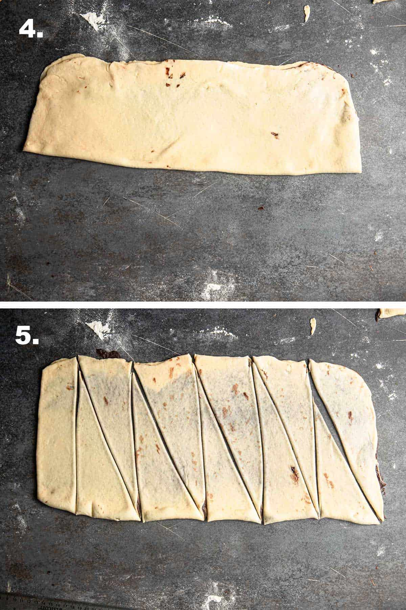

## ▶ Tészta

|  |  |
|----------|----------|
|**480g**|BL-55 liszt|
|**50g**|kristálycukor|
|**25g**|friss élesztő|
|**4g**|só|
|**2db**|nagyobb tojás|
|**180ml**|tej|
|**85g**|vaj|
|**1db**|tojás a lekenéshez|

## ▶ Csokis töltelék

|  |  |
|----------|----------|
|**180g**|puha vaj|
|**45g**|holland kakaópor|
|**4g**|só|
|**120g**|porcukor|
|**45g**|olvasztott étcsoki|

## ▶ Lekenős szírup

|  |  |
|----------|----------|
|**200g**|cukor|
|**240ml**|víz|

## ▶ Tészta elkészítése

1. A tejben oldjuk fel a cukrot és az élesztőt futassuk fel kb 10 percig
2. Szitáljuk a keverő tálba a lisztet, rejtsük el benne a sót és adjuk hozzá a tojásokat
3. Dagasszuk össze a tésztát majd ha kezd összeállni adjuk hozzá a vajat és folytassuk a dagasztást míg egynemű nem lesz
4. Takajuk le és várjuk meg míg kb kétszerese lesz, kb 90 perc

## ▶ Töltelék elkészítése
1. Olvasszuk fel a csokit és keverjük bele a hozzávalókat míg egynemű nem lesz

## ▶ Hajtogatás és formázás

Süssük 180°C-on 20-25 percig
Majd kenjük le a szíruppal